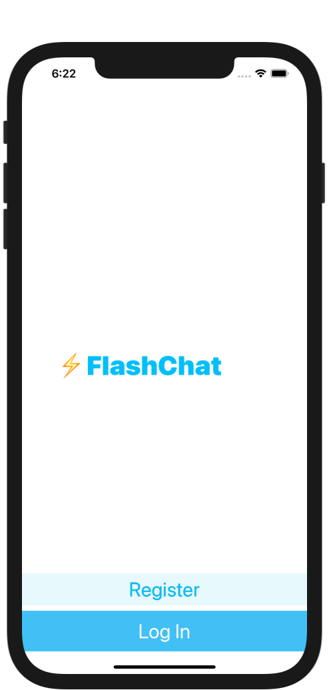
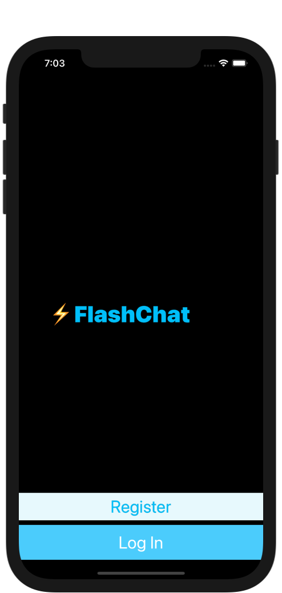
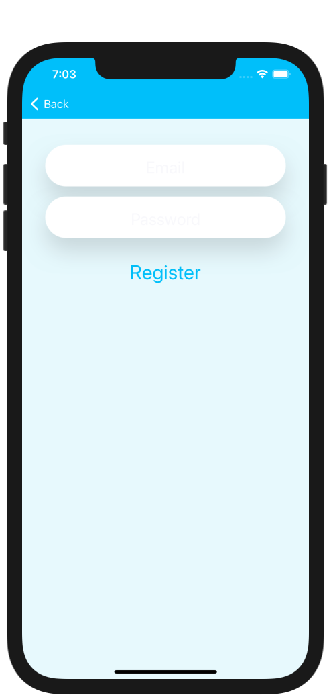
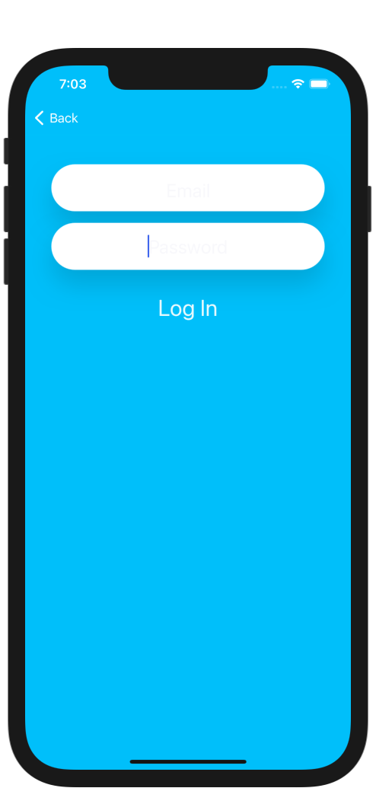
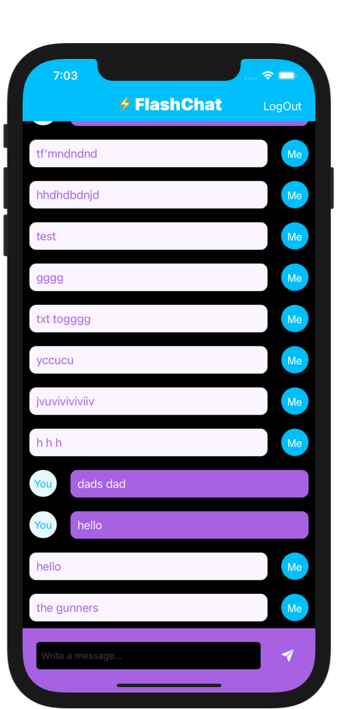

# Chat-App
### Screen Shots

---

### Table of Contents

- [Description](#description)
- [How To Use](#how-to-use)
- [Author Info](#author-info)

## Description

- Chat app that uses Firebase as it database to store and load messages

---

### What I Learned:

- How to integrate third party libraries in your app using Cocoapods and Swift Package Manager.
- How to store data in the cloud using Firebase Firestore.
- How to query and sort the Firebase database.
- How to use Firebase for user authentication, registration and login.
- How to work with UITableViews and how to set their data sources and delegates.
- How to create custom views using .xib files to modify native design components.
- How to embed View Controllers in a Navigation Controller and understand the navigation stack.
- How to create a constants file and use static properties to store Strings and other constants.
- Learn about Swift loops and create animations using loops.
- Learn about the App Lifecycle and how to use viewWillAppear or viewWillDisappear.
- How to create direct Segues for navigation.

---

## How To Use

- Clone the project and run it on Xcode
---

## Author Info
- Website - [LinkedIn: Gurpreet Singh](https://www.linkedin.com/in/gurpreet-singh-a2651b107/)

[Back To The Top](#Chat-App)
